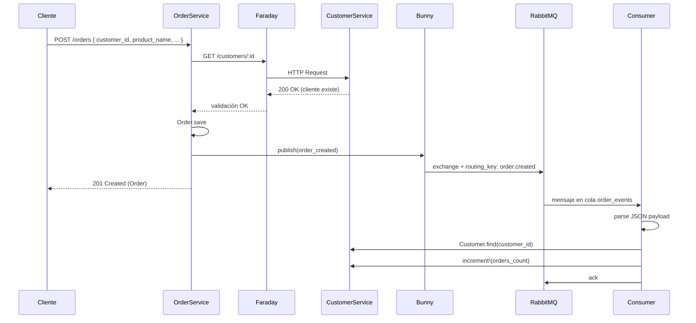

# Prueba Técnica FullStack - Monokera (Cristian David)

## Resumen

Implementación de dos microservicios Rails API que se comunican por **HTTP (Faraday)** y **eventos RabbitMQ (Bunny)**, cumpliendo los requisitos de la prueba técnica FullStack.

### Requisitos cumplidos

- **order-service**: crear y consultar pedidos, validar cliente vía HTTP a customer-service, emitir evento RabbitMQ al crear pedido.
- **customer-service**: consultar cliente (name, address, orders_count), escuchar evento RabbitMQ y actualizar `orders_count` automáticamente.
- Clientes predefinidos vía seeds (base fija, no crear nuevos).
- APIs REST: `POST /orders`, `GET /orders?customer_id=`, `GET /customers/:id`.
- Consistencia eventual: `orders_count` se actualiza cuando el consumer procesa el evento.

---

## Requisitos del sistema

| Componente | Versión |
|------------|---------|
| Ruby | 3.4+ |
| Rails | 8.1 |
| PostgreSQL | 17 |
| RabbitMQ | 4.2 |
| Node.js | (solo si se agrega frontend Next.js) |

---

## Instalación y configuración

### 1. Clonar e instalar dependencias

```bash
cd PruebaInetum
cd order-service && bundle install && cd ..
cd customer-service && bundle install && cd ..
```

### 2. Bases de datos

Crear manualmente en PostgreSQL:

```sql
CREATE DATABASE order_service_development;
CREATE DATABASE order_service_test;
CREATE DATABASE customer_service_development;
CREATE DATABASE customer_service_test;
```

Ejecutar migraciones:

```bash
cd order-service && rails db:migrate && cd ..
cd customer-service && rails db:migrate && cd ..
```

### 3. Configuración

**database.yml** (ambos proyectos, desarrollo local):

```yaml
development:
  adapter: postgresql
  database: order_service_development  # o customer_service_development
  username: postgres
  password: Junio.2021
  host: localhost
  port: 5432
```

**config/initializers/rabbitmq.rb** (ya configurado):

- Host: localhost:5672  
- Usuario/contraseña: guest/guest  
- Cola: `order_events`  
- Exchange: `order_exchange`  
- Routing key: `order.created`  

### 4. Seeds

```bash
cd customer-service
rails db:seed
```

Carga 5 clientes predefinidos (Juan Pérez Gómez, María López Ramírez, etc.).

---

## Ejecución

Abrir **4 terminales**:

### Terminal 1 – order-service (puerto 3000)

```bash
cd order-service
rails s -p 3000
```

### Terminal 2 – customer-service (puerto 3001)

```bash
cd customer-service
rails s -p 3001
```

### Terminal 3 – Consumer RabbitMQ

```bash
cd customer-service
rails order_events:consume
```

### Terminal 4 – Pruebas

Para hacer requests con curl o Postman.

---

## Cómo probar

### 1. Consultar cliente

```bash
curl http://localhost:3001/customers/1
```

**Respuesta ejemplo:**

```json
{
  "customer_name": "Juan Pérez Gómez",
  "address": "Cra 7 #123-45, Bogotá D.C.",
  "orders_count": 0
}
```

### 2. Crear pedido

```bash
curl -X POST http://localhost:3000/orders \
  -H "Content-Type: application/json" \
  -d '{"order":{"customer_id":1,"product_name":"Café Juan Valdez","quantity":2,"price":15000,"status":"pending"}}'
```

**Respuesta ejemplo (201 Created):**

```json
{
  "id": 1,
  "customer_id": 1,
  "product_name": "Café Juan Valdez",
  "quantity": 2,
  "price": "15000.0",
  "status": "pending",
  "created_at": "...",
  "updated_at": "..."
}
```

### 3. Listar pedidos por cliente

```bash
curl "http://localhost:3000/orders?customer_id=1"
```

### 4. Verificar actualización de orders_count

Tras crear un pedido, el consumer procesa el evento y actualiza `orders_count`:

```bash
curl http://localhost:3001/customers/1
# orders_count habrá aumentado en 1
```

---

## Diagrama del flujo (Mermaid)



**Flujo resumido:**

1. POST /orders → OrderService valida cliente vía Faraday.
2. Order.save → pedido creado.
3. Bunny publish → evento a RabbitMQ (order.created).
4. Response 201 al cliente.
5. Consumer recibe mensaje → incrementa `orders_count` en Customer.
6. Consistencia eventual (segundos después).

---

## Notas técnicas

### Consistencia eventual

- `orders_count` no se actualiza en la misma transacción que el pedido.
- El consumer procesa el mensaje de forma asíncrona.
- Resultado: `orders_count` refleja el total tras unos segundos.

### Desacoplamiento

- Order-service no llama directamente a customer-service para actualizar `orders_count`.
- Comunicación por eventos: publica y olvida.
- Customer-service decide cómo reaccionar al evento.

### Escalabilidad

- Varios consumers pueden procesar mensajes en paralelo.
- RabbitMQ garantiza entrega y persistencia de mensajes.
- Servicios independientes, desplegables por separado.

---

## Estructura del proyecto

```
PruebaInetum/
├── order-service/           # API de pedidos (puerto 3000)
│   ├── app/
│   │   ├── controllers/orders_controller.rb
│   │   ├── models/order.rb
│   │   └── services/order_event_publisher.rb
│   └── config/initializers/rabbitmq.rb
├── customer-service/        # API de clientes (puerto 3001)
│   ├── app/
│   │   ├── controllers/customers_controller.rb
│   │   ├── models/customer.rb
│   │   └── workers/order_events_consumer.rb
│   ├── db/seeds.rb
│   └── lib/tasks/order_events.rake
└── README.md
```
